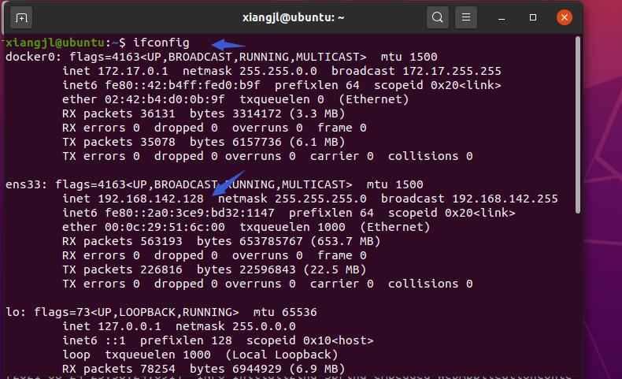

# Linux入门基础

## 1 安装虚拟机

1.1.1 安装VMVare（获取其他虚拟机软件）

1.1.2 安装Linux版本

## 2 MobaXterm

ModaXterm是一款功能比较强大的终端软件。

官方网站：https://mobaxterm.mobatek.net/

参考视频：https://www.bilibili.com/video/BV1n7411c7Kw?from=search&seid=6153195287928877986


**踩坑1：虚拟机的IP，新人容易取错**



**踩坑2：工具连接不上虚拟机**

虚拟机上运行

```
ssh localhost
```

报错

```
ssh connect to host localhost port22: Connection refused.
```

查看SSH安装情况

```
ps -e|grep ssh
```

如没有sshd则表示没有安装ssh服务器端，需要安装

```
sudo apt-get install openssh-server
```

安装完，可以再次检查安装是否成功。再次利用工具进行登录。

## 3 在Linux上运行Spring项目

### 3.1 准备跑运行的项目

项目打包可参考：https://www.cnblogs.com/swordfall/p/11359370.html

### 3.2 JDK安装与配置

1）官网下载JDK　

地址: http://www.oracle.com/technetwork/articles/javase/index-jsp-138363.html

2）解压缩

创建目录：

```
sudo mkdir /usr/lib/jvm
```

解压缩到该目录

```
sudo tar -zxvf jdk-8u211-linux-x64.tar.gz -C /usr/lib/jvm
```

3）修改环境变量

```
sudo vim ~/.bashrc
```

文件的末尾添加以下内容：

```
#set oracle jdk environment
export JAVA_HOME=/usr/lib/jvm/jdk1.7.0_60  ## 这里要注意目录要换成自己解压的jdk 目录
export JRE_HOME=${JAVA_HOME}/jre  
export CLASSPATH=.:${JAVA_HOME}/lib:${JRE_HOME}/lib  
export PATH=${JAVA_HOME}/bin:$PATH 
```

使环境变量马上生效

```
 source ~/.bashrc
```

4）测试JDK

```
java -version
```

结果输出：

```
java version "1.8.0_211"
***
```

### 3.3 运行Spring项目

拷贝项目至虚拟机上，执行Java -jar ***即可。

至此，Linux基本操作可以覆盖，如文件操作，软件安装，环境变量设置等。