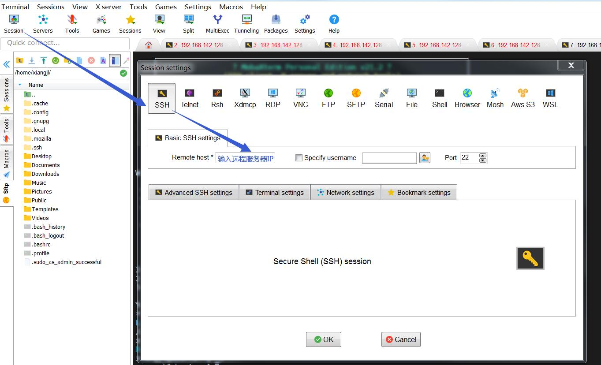
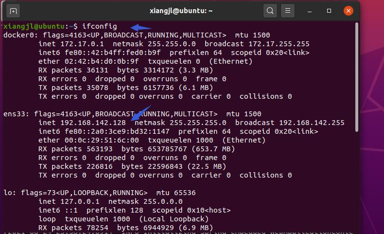
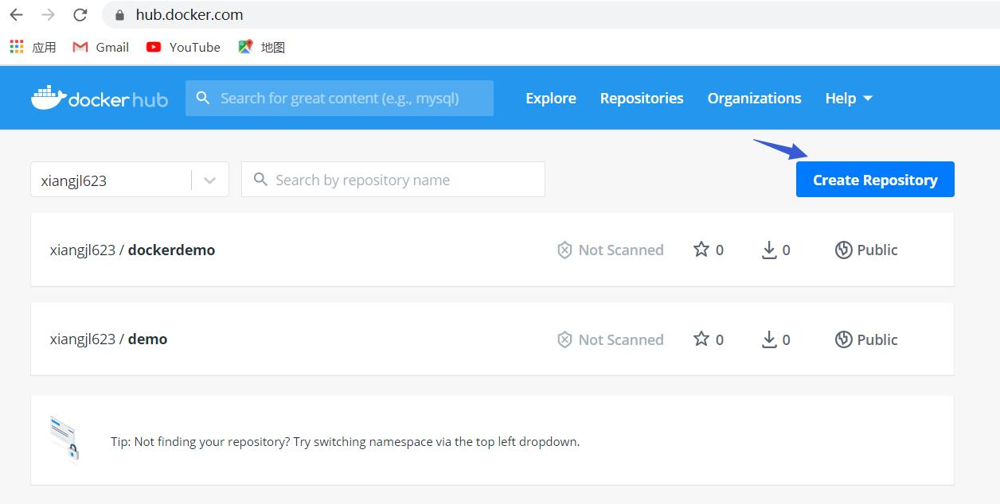
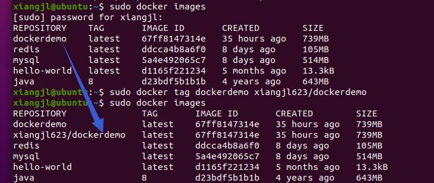
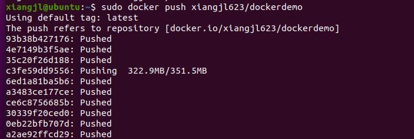
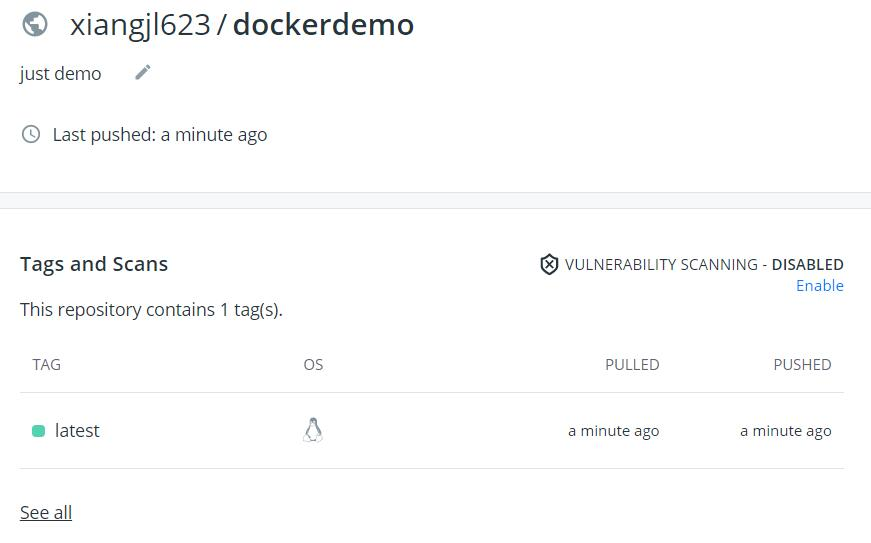
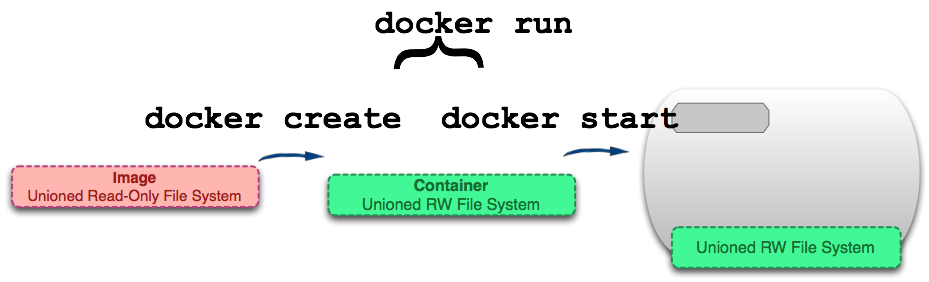

[TOC]

说明：本文阅读需要有一定Java基础，不再讨论基础语法，会讲解每门技术的基本原理，不做深入讨论，面向工程实践，结合过程中的踩坑，从而提升J2EE相关技术的能力。

# 1 Linux基本操作

## 1.1 安装虚拟机

1.1.1 安装VMVare（获取其他虚拟机软件）

1.1.2 安装Linux版本

## 1.2 MobaXterm

ModaXterm是一款功能比较强大的终端软件。

官方网站：https://mobaxterm.mobatek.net/

参考视频：https://www.bilibili.com/video/BV1n7411c7Kw?from=search&seid=6153195287928877986




**踩坑1：虚拟机的IP，新人容易取错**



**踩坑2：工具连接不上虚拟机**

虚拟机上运行

```
ssh localhost
```

报错

```
ssh connect to host localhost port22: Connection refused.
```

查看SSH安装情况

```
ps -e|grep ssh
```

如没有sshd则表示没有安装ssh服务器端，需要安装

```
sudo apt-get install openssh-server
```

安装完，可以再次检查安装是否成功。再次利用工具进行登录。

## 1.3 在Linux上运行Spring项目

### 1.3.1 准备跑运行的项目

项目打包可参考：https://www.cnblogs.com/swordfall/p/11359370.html

### 1.3.2 JDK安装与配置

1）官网下载JDK　

地址: http://www.oracle.com/technetwork/articles/javase/index-jsp-138363.html

2）解压缩

创建目录：

```
sudo mkdir /usr/lib/jvm
```

解压缩到该目录

```
sudo tar -zxvf jdk-8u211-linux-x64.tar.gz -C /usr/lib/jvm
```

3）修改环境变量

```
sudo vim ~/.bashrc
```

文件的末尾添加以下内容：

```
#set oracle jdk environment
export JAVA_HOME=/usr/lib/jvm/jdk1.7.0_60  ## 这里要注意目录要换成自己解压的jdk 目录
export JRE_HOME=${JAVA_HOME}/jre  
export CLASSPATH=.:${JAVA_HOME}/lib:${JRE_HOME}/lib  
export PATH=${JAVA_HOME}/bin:$PATH 
```

使环境变量马上生效

```
 source ~/.bashrc
```

4）测试JDK

```
java -version
```

结果输出：

```
java version "1.8.0_211"
***
```

### 1.3.3 运行Spring项目

拷贝项目至虚拟机上，执行Java -jar ***即可。

至此，Linux基本操作可以覆盖，如文件操作，软件安装，环境变量设置等。

# 2 Docker入门

## 2.1 Docker是什么？

Docker是一个虚拟环境容器，可以将你的开发环境、代码、配置文件等一并打包到这个容器中，并发布和应用到任意平台中。比如，你在本地用Python开发网站后台，开发测试完成后，就可以将Python3及其依赖包、Flask及其各种插件、Mysql、Nginx等打包到一个容器中，然后部署到任意你想部署到的环境。

官方文档：https://docs.docker.com/

**Docker的三个概念**

**1）镜像（Image）**：类似于虚拟机中的镜像，是一个包含有文件系统的面向Docker引擎的只读模板。任何应用程序运行都需要环境，而镜像就是用来提供这种运行环境的。例如一个Ubuntu镜像就是一个包含Ubuntu操作系统环境的模板，同理在该镜像上装上Apache软件，就可以称为Apache镜像。

**2）容器（Container）**：类似于一个轻量级的沙盒，可以将其看作一个极简的Linux系统环境（包括root权限、进程空间、用户空间和网络空间等），以及运行在其中的应用程序。Docker引擎利用容器来运行、隔离各个应用。容器是镜像创建的应用实例，可以创建、启动、停止、删除容器，各个容器之间是是相互隔离的，互不影响。注意：镜像本身是只读的，容器从镜像启动时，Docker在镜像的上层创建一个可写层，镜像本身不变。

**3）仓库（Repository）**：类似于代码仓库，这里是镜像仓库，是Docker用来集中存放镜像文件的地方。注意与注册服务器（Registry）的区别：注册服务器是存放仓库的地方，一般会有多个仓库；而仓库是存放镜像的地方，一般每个仓库存放一类镜像，每个镜像利用tag进行区分，比如Ubuntu仓库存放有多个版本（12.04、14.04等）的Ubuntu镜像。

## 2.2 安装

如果已经安装老版本的Docker，需要先卸载

```
sudo apt-get remove docker docker-engine docker.io containerd runc
```

安装依赖包

```
sudo apt install apt-transport-https ca-certificates curl gnupg-agent software-properties-common -y
```

导入源仓库的 GPG key

```
sudo wget https://download.docker.com/linux/ubuntu/gpg
sudo apt-key add gpg
```

添加Docker APT 软件源

```
sudo add-apt-repository "deb [arch=amd64] https://download.docker.com/linux/ubuntu $(lsb_release -cs) stable"
```

安装Docker 最新版本

```
sudo apt install docker-ce docker-ce-cli containerd.io -y
```

查看Docker是否启动成功

```
sudo systemctl status docker
```

## 2.3 镜像的基本操作

1) 查询镜像

```
sudo docker search ***
```

2) 拉取镜像

```
sudo docker pull ***:latest
```

3) 查看镜像

```
sudo docker images
```

4) 构建镜像

创建目录，拷贝运行文件至该目录

```
mkdir -p demo
cp [目录]\srcdemo demo\
cd demo
```

创建Dockfile

```
# Docker image for springboot file run
# VERSION 0.0.1
# Author: eangulee
# 基础镜像使用java
FROM java:8
# 作者
MAINTAINER *** <***@***>
# VOLUME 指定了临时文件目录为/tmp。
# 其效果是在主机 /var/lib/docker 目录下创建了一个临时文件，并链接到容器的/tmp
VOLUME /tmp 
# 将jar包添加到容器中并更名为app.jar
ADD *.jar app.jar 
# 运行jar包
RUN bash -c 'touch /app.jar'
ENTRYPOINT ["java","-Djava.security.egd=file:/dev/./urandom","-jar","/app.jar"]
```

构建

```
sudo docker build -t demo .
```

查看镜像，是否构建成功

```
sudo docker images
```

## 2.4 容器的基本操作

1）运行容器

```
# 运行mysql
sudo docker run -d \
--name mysql \
-e MYSQL_ROOT_PASSWORD=root \
mysql
```

```
# 运行redis
sudodocker run -d \
--name redis \
redis
```

2）查看容器

```
#查看正在运行的容器
sudo docker ps
#查看所有的容器
sudo docker ps -a
```

3）其他操作

```
# 停止容器
suo docker stop ***
# 重启容器
sudo docker restart ***
# 删除容器
sudo docker rm ***
# 查看容器日志
sudo docker logs -f ***
# 进入容器内容
sudo docker exec -ti *** bash
```

## 2.5 仓库的使用

1） 注册账号

https://hub.docker.com/

2）创建仓库



3）构造镜像

参考2.3

4）上传镜像到仓库

注意需要将镜像的名称与远程仓库的名称改为一致。

语法是： docker tag 仓库名 用户名/仓库名

```
sudo docker tag dockerdemo 用户名/dockerdemo
```



```
sudo docker push xiangjl623/dockerdemo
```



5）登录仓库检查是否已经上传成功



## 2.6 Docker常见的问题

1）容器与镜像的区别

https://www.cnblogs.com/LangXian/p/10639936.html

2）start与run命令的区别

https://www.cnblogs.com/x-poior/p/10566112.html



3）其他一些命令

```
#列出所有的容器ID
sudo docker ps -aq
#停止所有的容器
sudo docker stop $（sudo docker ps -aq）
#删除所有的容器
sudo docker rmi $（sudo docker ps -aq）
删除所有的镜像
docker rmi $(docker images -q)
```

