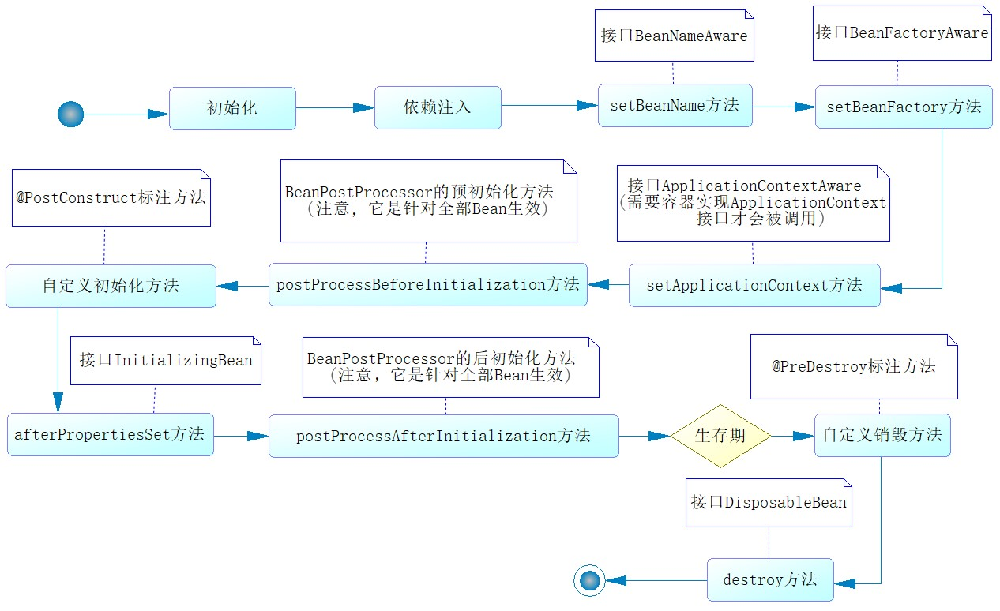

# 全注解下的Spring IOC

参考文档：https://www.jianshu.com/p/a02de8a672dc

## 1 介绍

IOC: Inverse of Control(控制反转)，读作反转控制更好理解，它不是技术而是一种设计思想，
将原本手动创建对象的控制权，交给spring框架来管理。

- **控制什么？**：这里的控制就是创建对象的过程，传统是我们直接使用new关键字让程序
  主动创建对象，而IOC由一个专门的容器来统一创建对象。
- **反转？**: 我们先理解正控，更具上面的理解，正控就是我们自己负责对象的创建，那么
  反转就是不需要自己创建，spring中需要依赖所在的容器来创建以及注入依赖的对象。
- **反转了什么?**: 反转了获取对象的过程，对象的创建和销毁不再由程序控制，而是由
  spring容器来控制。
  **总结：**根据上面的解释，控制反转就是当创建一个对象时，程序所依赖的对象由外部
  (spring容器)传递给他，而不是自己去创建(new)依赖的对象,因此可以说在对象如何获取
  它的依赖这件事上控制权被反转了。

## 2 好处

- **实现对象间的解耦**
  IOC容器可以实现对象间的解耦，把创建和查找对象的控制权交给容器，由容器进行对象的
  组合，所以对象之间是松散耦合，这样方便测试，也方便重复利用。

**spring IOC容器:**
spring IOC容器是一个管理bean的容器，在spring的定义中，它要求所有的IOC容器都需要实现接口
BeanFactory,它是一个接口，为我们提供了bean的获取，判断类型等方法。spring体系中BeanFactory
和ApplicationContext为最重要的接口设计，ApplicationContext不仅实现了BeanFactory还实现了很
多别的接口，使其功能更强大，所以在我们使用spring IOC容器中，大部分使用的是ApplicationContext
接口的实现类。

## 3 Bean装配方式

spring boot在启动完成之前会加载配置，这些配置之中就有spring中的bean的配置，我们就通过几种方式

来进行bean的配置。

#### 3.1 @Configuration和@Bean一起使用,使用Java类来进行项目装配，该方法一般用于加载第三方的bean类。

```java
@Configuration
public class AppConfig {
    @Bean(name = "user")
    public User initUser(){
        User user = new User();
        user.setLastName("tian");
        user.setAge(12);
        return user;
    }
}
```

**@Configuration：**上面已经提到，这个注解说明这个类是程序的配置类，springboot启动的时候会加载这个类里的配置内容。

**@Bean:**代表initUser方法返回的Object装配到容器中，name定义了这个bean的名称，如果没有配置，则将方法名"initUser"作为bean的名称装配到容器。

**获取bean的实例**

```java
public static void main(String[] args) {
        //使用springboot中的context加载AppConfig配置类的内容，
        ApplicationContext applicationContext = new AnnotationConfigApplicationContext(AppConfig.class);
        //通过context获取user实例
        User user = (User) applicationContext.getBean("user");
        log(user.toString());
}
```

### 3.2 扫描装配

springboot常用的装配是扫描装配，使用注解@Component和@ComponentScan。

#### 3.2.1 @Component

```java
@Component("user")
public class User {
    //使用@Value
    @Value("song")
    private String lastName;
    @Value("12")
    private Integer age;
    @Value("false")
    private Boolean boss;
    //set get方法。
}
```

**@Component:**指定该User类作为bean装配到容器，“user"表示装配时这个类的名字，如果没有”user"，springboot会将该类的类名首字母小写作为该类在容器中的名称。

**@Value:**为User类的属性赋值。

#### 3.2.2 @ComponentScan

```java
@Configuration
@ComponentScan
public class AppConfig {
}
```

首先要先添加@Configuration注解,标记这个类是配置类，这样才会在程序启动过程中加载该类。

**@ComponentScan:**:用这个类标记说明springboot会进行扫描，但springboot只会扫描AppConfig类所

在的包及其子包。查看@ComponentScan源码，可以知道它可以配置多个参数。

```java
//basepackage指定扫描的包及其子包
@ComponentScan(basePackages = {"com.tian.learn.SpringBootLearn.beans"})
//basePackageClasses定义扫描的类
@ComponentScan(basePackageClasses = {User.class, Dog.class})
//excludeFilter排除满足条件的bean，使用@Filter注解，使满足条件的bean不被装配。
@ComponentScan(basePackages = {"com.tian.learn.SpringBootLearn.beans"},
    excludeFilters = {@ComponentScan.Filter(classes = {Dog.class})})
```

## 4 依赖注入

前面讲了springboot Bean的装配，现在要解决的是类之间的依赖，这个依赖在spring IOC中称为依赖注入。

### 4.1 @Autowired初探

eg:这是一个人使用动物的例子

```java
//定义动物的接口
public interface Animal {
    void use();
}
```

```JAVA
//定义一个dog，使用注解让其称为装配的Bean
@Component
public class Dog implements Animal {
  @Override
  public void use() {
      System.out.println("dog wang wang wang!!!");
  }
}
```
```java
//定义人的接口
public interface Person {
  void service();
  void setAnimal(Animal animal);
}
```
```java
//定义人，实现人接口。
public class BussinessPerson implements Person {
  @Autowired  //springboot常用的依赖注入注解
  private Animal animal = null;
  @Override
  public void service() {
      animal.use();
  }
  @Override
  public void setAnimal(Animal animal) {
      this.animal = animal;
  }
}
```
```java
//定义配置类
@ComponentScan(basePackages = "com.example.demo")
public class AppConfig {
}
```

```java
//验证
public static void main(String[] args) {
   //使用springboot中的context加载AppConfig配置类的内容，
    ApplicationContext applicationContext = new AnnotationConfigApplicationContext(AppConfig.class);
    //通过context获取user实例
    BussinessPerson person = (BussinessPerson) applicationContext.getBean(BussinessPerson.class);
    person.service();
 }
```
### 4.2 @Autowired详解

#### 4.2.1 在方法上使用@Autowired

@Autowired可以使用在变量上也可以使用在方法上

```java
//定义人，实现人接口。
@Component
public class BussinessPerson implements Person {
    /****/
    @Override
    @Autowired
    public void setAnimal(Animal animal) {
        this.animal = animal;
    }
}
```

#### 4.2.2 可为NULL标注

使用@Autowired默认必须找到Bean进行注入，如果标注的属性可以为NULL,需要使用@Autowired的required属性标注，false为可以为null, 默认为true

```java
//定义人，实现人接口。
@Component("bussinessperson")
public class BussinessPerson implements Person {
    @Autowired(required=false)  //springboot常用的依赖注入注解
    private Animal animal = null;
    /***...**/    
  }
```

#### 4.2.3 歧义性

**歧义性：**因为@Autowried自动注入的规则，当多个相同类型(type,eg:上面程序除了Dog或者可能还有Cat)的类同时存在与spring IOC中时，运行程序就会报错，因为spring不知道该注入哪一个。上面程序因为只有一个Dog，所以对Animal的注入不会产生歧义性。

##### 4.2.3.1 用实际类名命名需要注入的变量名(这种方法一般不会使用，局限性大)

在上面程序中如果出现另一个Animal，就会造成程序运行错误，这时可以改变BussinessPerson中Animal变了的名字，spring会根据名字进行注入，名字为需要注入的类名。

```java
//定义人，实现人借口。
@Component("bussinessperson")
public class BussinessPerson implements Person {
    @Autowired  //springboot常用的依赖注入注解
    private Animal dog = null; //将Dog类名写到这里，dog小写
}
```

##### 4.2.3.2 @Primary和@Qualifier

**@Primary:**优先，告诉spring容器当发现同类型的Bean时，优先使用我进行注入。

```java
@Component
@Primary
public class Cat implements Animal {
    @Override
    public void use() {
        System.out.println("cat zhua laoshu");
    }
}
```

**@Qualifier:**:有时候@Primary也会存在在多个相同类型的Bean上，这时会又造成歧义性，我们可以使用@Quefilier加上@Autowired来操作，他的参数value需要一个字符串去定义，这个字符串为Bean的名称，Bean的名称在spring IOC中是唯一的，这样就没有了歧义性。

```java
//定义人，实现人借口。
@Component("bussinessperson")
public class BussinessPerson implements Person {
    @Autowired  //springboot常用的依赖注入注解
    @Qualifier("dog")
    private Animal animal = null; //将Dog类名写到这里，dog小写
}
```

#### 4.2.4 带参数的构造方法类的装配

在一些情况下有些类只有带参数的构造方法，于是上述的注入方法就不能使用了，这个情况下我们可以使用@Autowired对构造方法的参数进行注入。

```java
@Component("bussinessperson")
public class BussinessPerson implements Person {
    private Animal animal = null;
    //使用两个注解和上面的方式一样消除歧义性。
    public BussinessPerson(@Autowired @Qualifier("dog") Animal animal){
        this.animal = animal;
    }
    
    @Override
    public void service() {
        animal.use();
    }
    @Override
    public void setAnimal(Animal animal) {
        this.animal = animal;
    }
}
```

### 5 Bean的生命周期

在一些情况下，我们需要自己掌控spring中bean的初始化和销毁，例如，对数据库进行操作时我们在使用完后希望close它自己。这就需要我们详细了解一下spring中bean的生命周期，spring中bean的生命周期可大致分为，bean的定义、bean的初始化、bean的生存周期、bean的销毁4个部分。

### 5.1 Bean的定义

- spring通过配置的@ComponentScan和@Component进行资源定位。
- 找到资源进行解析，并将这些信息保存起来。这时还没有初始化bean，没有bean的实例，只是保存了bean的信息。
- 然后将bean的信息发布到spring IOC容器中，此时IOC容器中也只有Bean的定义，没有bean的实例。

### 5.2 Bean的初始化

在默认的情况下进行完5.1的3个步骤后直接就会执行Bean的初始化过程，创建bean的实例，并完成依赖注入，在这里我们可以控制bean让其不进行实例化，之后使用的时候在进行初始化。
**@ComponentScan**有一个参数为**lazyInit**,它默认是false,这样会直接进行实例化bean，true则是进行延迟初始化。

```java
@ComponentScan(basePackages = {"com.tian.learn.SpringBootLearn.beans"}, lazyInit = true)
```

#### 5.2.1 Bean的初始化流程

这张图显示了整个IOC容器初始化bean的流程，从这张图中我们可以看到多个接口多个注解，

- BeanNameAware:在调用依赖注入后会调用，
- BeanFactoryAware:在设置Bean工厂时会调用
- ApplicationContextAware:这个接口只有实现了ApplicationContext接口的容器才会调用。
- BeanPostProcessor接口是针对所有的bean的，里面postProcessBeforeInitialization/postProcessAfterInitialization，这两个分别在之前和之后调用，
  *@PostConstruct：方法注解。该注解标记的方法为自定义初始化方法，会在步骤中调用。
- InitializingBean: 调用了自定义方法后会调用该接口，方法afterPropertiesSet
- @PreDestory: 自定义销毁方法，与@PostConstruct方法注解使用方式一致。
- DisposableBean: 系统销毁Bean的回调。

```java
//eg
@Component("bussinessperson")
public class BussinessPerson implements Person, BeanNameAware, BeanFactoryAware,
        ApplicationContextAware, InitializingBean, DisposableBean {
    private Animal animal = null;
    public BussinessPerson(){

    }

    @Override
    public void service() {
        animal.use();
    }
    @Override @Autowired @Qualifier("dog")
    public void setAnimal(Animal animal) {
        this.animal = animal;
        SpringBootLearnApplication.log("延迟初始化");
    }

    @PostConstruct
    public void init(){
        System.out.println(this.getClass().getSimpleName() + " init ");
    }

    @PreDestroy
    public void destory1(){
        System.out.println(this.getClass().getSimpleName() + " destory1");
    }
    @Override
    public void setBeanName(String name) {
        System.out.println(this.getClass().getSimpleName() + " setBeanName: " + name );
    }

    @Override
    public void setBeanFactory(BeanFactory beanFactory) throws BeansException {
        System.out.println(this.getClass().getSimpleName() + 
          " setBeanFactory: " + beanFactory.toString());
    }

    @Override
    public void destroy() throws Exception {
        System.out.println(this.getClass().getSimpleName() + " destory");
    }

    @Override
    public void afterPropertiesSet() throws Exception {
        System.out.println(this.getClass().getSimpleName() + " afterPropertiesSet");
    }

    @Override
    public void setApplicationContext(ApplicationContext applicationContext) throws BeansException {
        System.out.println(this.getClass().getSimpleName() + " setApplicationContext: " +    
                 applicationContext.getApplicationName());
    }
}
```

注意：当我们使用第三方的Bean的时候，可以使用@Bean定义自定义的初始化和销毁方法

```java
@Bean(initMethod="init", destoryMethod="destory1")
```

### 6 使用属性文件

spring之前一致使用的是配置文件有properties、xml等，spring boot也同样可以使用，这里我们直接使用

application.properties文件

```java
driver.name=com.mysql.jdbc.Driver
driver.url=jdbc:mysql://localhost:8080/
driver.username=tian
driver.password=123
```

在bean中使用配置文件,使用@Value注解和${}占位符进行属性文件的读取

```java
@Component
public class MySqlDataSource implements Condition {
    @Value("${driver.name}")
    private String name = null;
    @Value("${driver.url}")
    private String url = null;
    @Value("${driver.password}")
    private String password = null;
}
```

**@ConfigurationProperties:**这个注解可以减少我们读取配置文件时的配置，同样是上述代码，使用该注解为

```java
@Component
@ConfigurationProperties("driver")
public class MySqlDataSource implements Condition {
    private String name = null;
    private String url = null;
    private String password = null;
}
```

该注解中的字符串driver会与bean的属性名组成全限定名从配置文件中查找。

**@PropertySource:**该注解可以让我们的springboot加载其他的配置文件。

```java
@SpringBootApplication
@PropertySource(value = {"classpath:jdbc.properties"}, ignoreResourceNotFound = true)
public class SpringBootLearnApplication {}
```

**classpath：**代表从类文件路径下找属性文件jdbc.properties,

**ignoreResourceNotFound:**从名字上可以看出，这个是忽略属性文件找不到的问题。

##  7 条件装配Bean

在一定条件下我们需要参数配置等满足条件后才进行Bean的初始化，例如数据库的链接参数全部满足后才初始化bean，这里spring给我们提供了@Conditional注解配合接口Condition来完成。

**condition**接口来完成对比，查看是否能创建。

```java
public class ConditionalOne implements Condition {
    @Override
    public boolean matches(ConditionContext context, AnnotatedTypeMetadata metadata) {
        return false;
    }
}
```

使用两个注解@Bean和@Conditional来完成，这样就能更具matches的返回值判断时候初始化这个Bean

```java
 @Bean
 @Conditional(ConditionalOne.class)
 public MySqlDataSource getDataSource(){
   MySqlDataSource mySqlDataSource = new MySqlDataSource();
   mySqlDataSource.setName("tian");
   mySqlDataSource.setPassword("123");
   mySqlDataSource.setUrl("localhost");
   return mySqlDataSource;
 }
```

## 7 Bean的作用域

在IOC中默认Bean都是单例的，springboot还使用在web中，所以bean的作用于如图:


```java
@Component
//@Scope(ConfigurableBeanFactory.SCOPE_PROTOTYPE)
public class ScopeBean {
}
```

```java
public class test01 {
    //验证
    public static void main(String[] args) {
        //使用springboot中的context加载AppConfig配置类的内容，
        ApplicationContext applicationContext = new AnnotationConfigApplicationContext(AppConfig.class);
        ScopeBean s1 = applicationContext.getBean(ScopeBean.class);
        ScopeBean s2 = applicationContext.getBean(ScopeBean.class);
        System.out.println(s1 == s2);
    }
}
```

运行结果：true.

## 8 @Profile注解

在项目中我们面临不同的环境，开发环境、测试环境、生产环境等，不同的环境配置不同，这就需要不同的配置文件，@Profile就是解决这个问题， 这里不在做详细描述。

## 9 引入XML配置Bean

之前的spring开发大部分都是使用xml配置bean，现在还有一些框架还在使用xml,这样我们在开发过程中使用该框架需要使用xml方式来实现。

**@importSource:**引入xml来配置Bean

```java
@Configuration
@ComponentScan(basePackages = {"com.tian.learn.SpringBootLearn.beans"} )
@importSource(value={"classpath:spring-other.xml"})
public class AppConfig {}
```

## 10 spring EL

spring EL可以功能更强大的为spring bean的属性赋值

- 赋值字符串  @Value("#{'tian'}")
- 占位符： @Value("${[driver.name](http://driver.name)}), 他会读取上下文属性值来装配到bean中。
- 获取其他bean的属性 @Value("#{[PersionBean.name](http://PersionBean.name)}")
- 运算 @Value("#{1+2}")
- 三元运算  @Value("#{age>50? '老‘：“年轻’}")