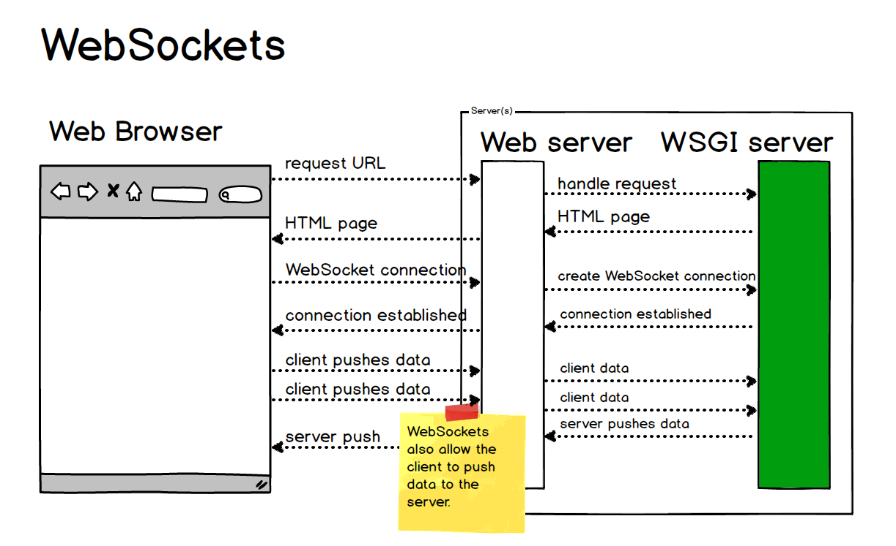
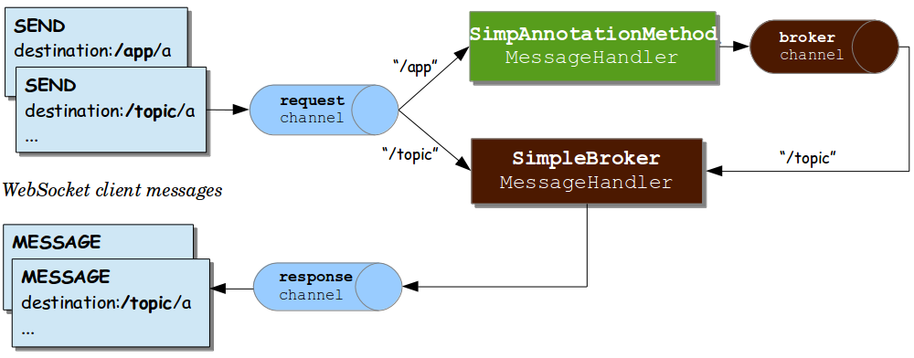
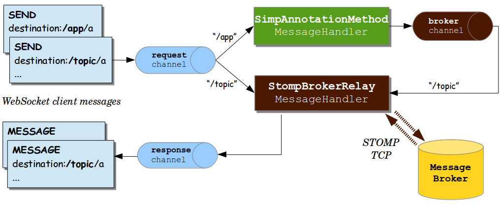
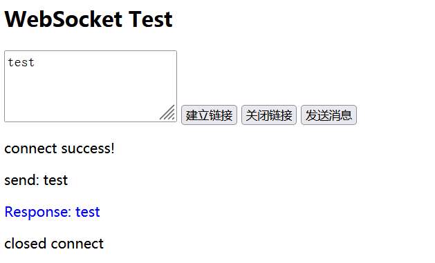

# WebSocket入门基础

## 1 为什么需要WebSocket？

参考文档：https://www.cnblogs.com/wxd0108/p/7999939.html

了解计算机网络协议的人，应该都知道：HTTP 协议是一种无状态的、无连接的、单向的应用层协议。它采用了请求/响应模型。通信请求只能由客户端发起，服务端对请求做出应答处理。**这种通信模型有一个弊端：HTTP 协议无法实现服务器主动向客户端发起消息。**这种单向请求的特点，注定了如果服务器有连续的状态变化，客户端要获知就非常麻烦。大多数 Web 应用程序将通过频繁的异步JavaScript和XML（AJAX）请求实现长轮询。轮询的效率低，非常浪费资源（因为必须不停连接，或者 HTTP 连接始终打开）

Web服务器网关接口（Web Server Gateway Interface，缩写为*WSGI*）

此，工程师们一直在思考，有没有更好的方法。WebSocket 就是这样发明的。WebSocket 连接允许客户端和服务器之间进行全双工通信，以便任一方都可以通过建立的连接将数据推送到另一端。WebSocket 只需要建立一次连接，就可以一直保持连接状态。这相比于轮询方式的不停建立连接显然效率要大大提高。



## 2 WebSocket实现原理

Spring 内置简单消息代理。这个代理处理来自客户端的订阅请求，将它们存储在内存中，并将消息广播到具有匹配目标的连接客户端。



上图3个消息通道说明如下：

```
“clientInboundChannel” — 用于传输从webSocket客户端接收的消息 
“clientOutboundChannel” — 用于传输向webSocket客户端发送的消息
“brokerChannel” — 用于传输从服务器端应用程序代码向消息代理发送消息
```

一般WebSocket与消息队列进行协作处理消息的处理与转发。



## 3 Spring WebSocket前后端实践

### 3.1 建立Spring项目

pom.xml配置如下，其他方式类似，不再赘述

```
   <dependencies>
        <dependency>
            <groupId>org.springframework.boot</groupId>
            <artifactId>spring-boot-starter-web</artifactId>
        </dependency>

        <dependency>
            <groupId>org.springframework.boot</groupId>
            <artifactId>spring-boot-starter-test</artifactId>
            <scope>test</scope>
        </dependency>
        <dependency>
            <groupId>org.springframework.boot</groupId>
            <artifactId>spring-boot-starter-websocket</artifactId>
        </dependency>
    </dependencies>
```

### 3.2 JAVA核心代码

消息处理器MessageHandler.java

```
import org.slf4j.Logger;
import org.slf4j.LoggerFactory;
import org.springframework.web.socket.CloseStatus;
import org.springframework.web.socket.TextMessage;
import org.springframework.web.socket.WebSocketSession;
import org.springframework.web.socket.handler.TextWebSocketHandler;

public class MessageHandler extends TextWebSocketHandler {

    private static final Logger LOGGER = LoggerFactory.getLogger(MessageHandler.class);

    @Override
    public void afterConnectionEstablished(WebSocketSession session) {
        LOGGER.info("WebSocket 连接建立......");
    }

    @Override
    protected void handleTextMessage(WebSocketSession session, TextMessage message) throws Exception {

        LOGGER.info("接收到消息：" + message.getPayload());
        Thread.sleep(2000);
        //发送收到的消息或别的消息
        session.sendMessage(new TextMessage(message.getPayload().toString()));
    }

    @Override
    public void afterConnectionClosed(WebSocketSession session, CloseStatus closeStatus){
        LOGGER.info("WebSocket 连接关闭......");
    }
}
```

拦截器WebsocketHandshakeInterceptor.java 一般验证用户授权在此类进行。

本文简单验证用户名和密码，均为“test”

```
import org.slf4j.Logger;
import org.slf4j.LoggerFactory;
import org.springframework.http.server.ServerHttpRequest;
import org.springframework.http.server.ServerHttpResponse;
import org.springframework.http.server.ServletServerHttpRequest;
import org.springframework.web.socket.WebSocketHandler;
import org.springframework.web.socket.server.support.HttpSessionHandshakeInterceptor;

import javax.servlet.http.HttpServletRequest;
import java.util.Map;

public class WebsocketHandshakeInterceptor extends HttpSessionHandshakeInterceptor {

    private Logger logger = LoggerFactory.getLogger(WebsocketHandshakeInterceptor.class);

    /**
     * 当客户端与服务器端握手之前之前执行的方法
     * 取出当前存在session的用户信息，封装到WebSocket对象中的map中；
     * 由Handler处理器中获取id
     * @return
     */
    @Override
    public boolean beforeHandshake(ServerHttpRequest request, ServerHttpResponse response, WebSocketHandler wsHandler,
                                   Map<String, Object> attributes) throws Exception {
        //将增强的request转换httpservletRequest
        if (request instanceof ServletServerHttpRequest) {
            ServletServerHttpRequest serverHttpRequest = (ServletServerHttpRequest) request;
            HttpServletRequest servletRequest = serverHttpRequest.getServletRequest();
            String sUser = servletRequest.getParameter("user");
            String sPassword = servletRequest.getParameter("password");
            boolean isValid = "test".equals(sUser) && "test".equals(sPassword);
            logger.info("检查连接webSocket用户的合法性: 用户user:[{}]，password:[{}]", sUser, sPassword);
            // 如果用户不合法则拦截
            if (!isValid) {
                logger.warn("权限校验用户不合法: webSocket握手失败,用户account:[{}]没有权限连接webSocket", sUser);
                return false;
            }
            logger.info("权限校验用户合法: webSocket握手成功,用户account:[{}]有权限连接webSocket", sUser);
            return super.beforeHandshake(request, response, wsHandler, attributes);
        }
        //放行
        return true;
    }

    /**
     * 与服务器websoket建立握手之后执行的方法
     */
    @Override
    public void afterHandshake(ServerHttpRequest request, ServerHttpResponse response, WebSocketHandler handler, Exception exception) {
        super.afterHandshake(request, response, handler, exception);
    }
}
```

### 3.3 前端代码

websocket.html

```
<!DOCTYPE html>  
<meta charset="utf-8" />  
<title>WebSocket Test</title>  
<script language="javascript"type="text/javascript">  
    var wsUrl ="ws://localhost:8080/myHandler?user=test&password=test"; 
    var output; 
    var websocket = null;	
    function init() { 
       output = document.getElementById("output"); 
	   initWebSocket();
    }  
	
    function initWebSocket() { 
        websocket = new WebSocket(wsUrl); 
        websocket.onopen = function(evt) { 
            onOpen(evt) 
        }; 
        websocket.onclose = function(evt) { 
            onClose(evt) 
        }; 
        websocket.onmessage = function(evt) { 
            onMessage(evt) 
        }; 
        websocket.onerror = function(evt) { 
            onError(evt) 
        }; 
    }  
	
    function onOpen(evt) { 
        writeToScreen("connect success!"); 
    }  
 
    function onClose(evt) { 
        writeToScreen("closed connect"); 
    }  
 
    function onMessage(evt) { 
        writeToScreen('<span style="color: blue;">Response: '+ evt.data+'</span>');   
    }  
 
    function onError(evt) { 
        writeToScreen('<span style="color: red;">Error:</span> '+ evt.data); 
    }  
 
    function doSend(message) { 
        writeToScreen("send: " + message);  
        websocket.send(message); 
    }  
 
    function writeToScreen(message) { 
        var pre = document.createElement("p"); 
        pre.style.wordWrap = "break-word"; 
        pre.innerHTML = message; 
        output.appendChild(pre); 
    } 
    
    function sendMessage(){
	    var sMessage = document.getElementById("text").value;
		doSend(sMessage);
    }
	
	function openWebsocket(){
	   if(!websocket){
	     initWebSocket();
	   }  
	}
	
	function coloseWebsocket(){
	   if(websocket){
	      websocket.close();
		  websocket = null;
	   }  
	}
    
    window.addEventListener("load", init, false);  	
</script>  
<h2>WebSocket Test</h2> 
<textarea rows="3" cols="20" id="text">
</textarea>
<button onclick="openWebsocket()"/>建立链接</button>
<button onclick="coloseWebsocket()"/>关闭链接</button>
<button onclick="sendMessage()"/>发送消息</button>
<div id="output"></div>  
</html>
```

3.3.4 运行结果

### 

## 4 思考

目前WebSocket广泛应用于前后端心跳检测，协同通知等，后续会加强相关Demo实例研发。