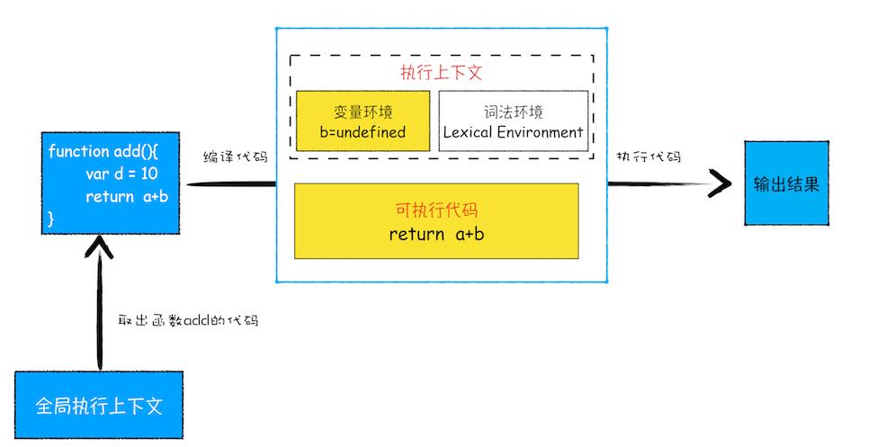

内容来源：极客时间：李兵--浏览器工作原理与实践

https://time.geekbang.org/column/intro/100033601?tab=catalog

# 1 宏观视角下的浏览器

# 2 浏览器中的Javascript运行机制

## 2.1 变量提升

### 2.1.1 变量的声明和赋值

下面这段代码输出的结果是什么？

```js
console.log(myname)
var myname = '极客时间'
console.log(myname1)
```

> 说明
>
> 1) 在执行过程中，若使用了未声明的变量，那么 JavaScript 执行会报错。
>
> 2) 在一个变量定义之前使用它，不会出错，但是该变量的值会为 undefined，而不是定义时的值。


### 2.1.2 函数的声明和赋值

```js
foo()
bar()
function foo(){
  console.log('foo')
}  
var bar = function(){
  console.log('bar')
}
```


> 在一个函数定义之前使用它，不会出错，且函数能正确执行。

### 2.1.3 JavaScript 代码的执行流程

从概念的字面意义上来看，“变量提升”意味着变量和函数的声明会在物理层面移动到代码的最前面，正如我们所模拟的那样。但，这并不准确。实际上变量和函数声明在代码里的位置是不会改变的，而且是在编译阶段被
 JavaScript 引擎放入内存中。对，你没听错，一段 JavaScript 代码在执行之前需要被 JavaScript 
引擎编译，编译完成之后，才会进入执行阶段。大致流程你可以参考下图：


### 2.1.4 问题

```js
showName()
var showName = function() {
console.log(2)
}

function showName() {
console.log(1)
}
```

```js
showName()
function showName() {
console.log(1)
}
var showName = function() {
console.log(2)
}
```

## 2.2 调用栈

### 2.2.1 函数调用

```js
var a = 2
function add(){
  var b = 10
  return a+b
}
add()
```


执行上下文准备好之后，便开始执行全局代码，当执行到
 add 这儿时，JavaScript 判断这是一个函数调用，那么将执行以下操作：

- 首先，从全局执行上下文中，取出 add 函数代码。
- 其次，对 add 函数的这段代码进行编译，并创建该函数的执行上下文和可执行代码。
- 最后，执行代码，输出结果。

完整流程你可以参考下图：就这样，当执行到 add 函数的时候，我们就有了两个执行上下文了——全局执行上下文和 add 函数的执行上下文。



### 2.2.2 栈

```js
var a = 2
function add(b,c){
  return b+c
}
function addAll(b,c){
  var d = 10
  result = add(b,c)
  return  a+result+d
}
addAll(3,6)
```


### 2.2.3 查看调用栈


### 2.2.4 栈溢出（Stack Overflow)

```js
function division(a,b){
	return division(a,b)
}
console.log(division(1,2))
```

那为什么会出现这个问题呢？这是因为当 JavaScript 引擎开始执行这段代码时，它首先调用函数 division，并创建执行上下文，压入栈中；然而，这个函数是递归的，并且没有任何终止条件，所以它会一直创建新的函数执行上下文，并反复将其压入栈中，但栈是有容量限制的，超过最大数量后就会出现栈溢出的错误。

> 理解了栈溢出原因后，你就可以使用一些方法来避免或者解决栈溢出的问题，比如把递归调用的形式改造成其他形式，或者使用加入定时器的方法来把当前任务拆分为其他很多小任务。

### 2.2.5 总结

> - 每调用一个函数，JavaScript引擎会为其创建执行上下文，并把该执行上下文压入调用栈，然后 JavaScript 引擎开始执行函数代码。
> - 如果在一个函数 A 中调用了另外一个函数 B，那么 JavaScript 引擎会为 B 函数创建执行上下文，并将 B 
>   函数的执行上下文压入栈顶。
> - 当前函数执行完毕后，JavaScript 引擎会将该函数的执行上下文弹出栈。
> - 当分配的调用栈空间被占满时，会引发“堆栈溢出”问题。

- 栈是一种非常重要的数据结构，不光应用在 JavaScript 语言中，其他的编程语言，如 C/C++、Java、Python 等语言，在执行过程中也都使用了栈来管理函数之间的调用关系。所以栈是非常基础且重要的知识点，你必须得掌握。

## 2.2.6 思考

会出现溢出吗？如何避免？

```js
function runStack (n) {
  if (n === 0) return 100;
  return runStack(n - 2);
}
runStack(50000)
```

## 2.3 块级作用域

### 2.3.1 作用域（scope）

**作用域**是指在程序中定义变量的区域，该位置决定了变量的生命周期。通俗地理解，作用域就是变量与函数的可访问范围，即作用域控制着变量和函数的可见性和生命周期。

在 ES6 之前，ES 的作用域只有两种：全局作用域和函数作用域。

> - 全局作用域中的对象在代码中的任何地方都能访问，其生命周期伴随着页面的生命周期。
> - 函数作用域就是在函数内部定义的变量或者函数，并且定义的变量或者函数只能在函数内部被访问。函数执行结束之后，函数内部定义的变量会被销毁。

```js
//if块
if(1){}

//while块
while(1){}

//函数块
function foo(){}

//for循环块
for(let i = 0; i<100; i++){}

//单独一个块
{}
```

```js
var myname = "极客时间"
function showName(){
  console.log(myname);
  if(1){
   var myname = "极客邦"
  }
  console.log(myname);
}
showName()
```

输出结果是啥？

### 2.3.2 本应销毁的变量没有被销毁

```js
function foo(){
  for (var i = 0; i < 7; i++) {
  }
  console.log(i); 
}
foo()
```

### 2.3.3 ES6 是如何解决变量提升带来的缺陷

上面我们介绍了变量提升而带来的一系列问题，为了解决这些问题，ES6 引入了 let 和 const 关键字，从而使 JavaScript 也能像其他语言一样拥有了块级作用域。

```js
function varTest() {
  var x = 1;
  if (true) {
    var x = 2;  // 同样的变量!
    console.log(x);  // 2
  }
  console.log(x);  // 2
}
```


```js
function letTest() {
  let x = 1;
  if (true) {
    let x = 2;  // 不同的变量
    console.log(x);  // 2
  }
  console.log(x);  // 1
}
```

### 2.3.4 JavaScript 是如何支持块级作用域的

```js
function foo(){
  var a = 1
  let b = 2
  {
    let b = 3
    var c = 4
    let d = 5
    console.log(a)
    console.log(b)
  }
  console.log(b) 
  console.log(c)
  console.log(d)
}   
foo()
```

运行结果：1 3 2 4 报错

### 2.3.5 问题

```js
let myname = '极客时间'
{
  console.log(myname) 
  let myname = '极客邦'
}
```

输出： VM346:3 Uncaught ReferenceError: Cannot access 'myname111' before initialization at <anonymous>:3:15

## 2.4 作用域链和闭包

```js
function bar() {
	console.log(myName)
}

function foo() {
    var myName = "极客邦"
    bar()
}
var myName = "极客时间"
foo()
```

### 2.4.1 作用域链


### 2.4.2 词法作用域

词法作用域就是指作用域是由代码中函数声明的位置来决定的，所以词法作用域是静态的作用域，通过它就能够预测代码在执行过程中如何查找标识符。


```js
function bar() {
  var myName = "极客世界"
  let test1 = 100
  if (1) {
    let myName = "Chrome浏览器"
    console.log(test)
  }
}
function foo() {
  var myName = "极客邦"
  let test = 2
  {
   let test = 3
   bar()
  }
}
var myName = "极客时间"
let myAge = 10
let test = 1
foo()
```


### 2.4.3 闭包

```JS
function foo() {
    var myName = "极客时间"
    let test1 = 1
    const test2 = 2
    var innerBar = {
        getName:function(){
            console.log(test1)
            return myName
        },
        setName:function(newName){
            myName = newName
        }
    }
    return innerBar
}
var bar = foo()
bar.setName("极客邦")
bar.getName()
console.log(bar.getName())
```

首先我们看看当执行到 foo 函数内部的return innerBar这行代码时调用栈的情况，你可以参考下图：


据词法作用域的规则，内部函数 getName 和 setName 总是可以访问它们的外部函数 foo 中的变量，所以当 innerBar 对象返回给全局变量 bar 时，虽然 foo 函数已经执行结束，但是 getName 和 setName 函数依然可以使用 foo 函数中的变量 myName 和 test1。所以当 foo 函数执行完成之后，其整个调用栈的状态如下图所示：


**在 JavaScript 中，根据词法作用域的规则，内部函数总是可以访问其外部函数中声明的变量，当通过调用一个外部函数返回一个内部函数后，即使该外部函数已经执行结束了，但是内部函数引用外部函数的变量依然保存在内存中，我们就把这些变量的集合称为闭包。比如外部函数是foo，那么这些变量的集合就称为 foo 函数的闭包。**

闭包是怎么回收的？

> **所以在使用闭包的时候，你要尽量注意一个原则：如果该闭包会一直使用，那么它可以作为全局变量而存在；但如果使用频率不高，而且占用内存又比较大的话，那就尽量让它成为一个局部变量。**

### 2.4.4 问题

```js
var bar = {
  myName:"time.geekbang.com",
  printName: function () {
    console.log(myName)   
  }    
}
function foo() {
  let myName = "极客时间"
  return bar.printName
}
let myName = "极客邦"
let _printName = foo()
_printName()
bar.printName()
```

## 2.5 this

JS代码：

```js
var bar = {
  myName:"time.geekbang.com",
  printName: function () {
     console.log(myName)
  }    
  }
function foo() {
  let myName = "极客时间"
  return bar.printName
}
let myName = "极客邦"
let _printName = foo()
_printName()
bar.printName()
```

```c++
include <iostream>
using namespace std;
class Bar{
public:
  char* myName;
  Bar(){
    myName = "time.geekbang.com";
  }
  void printName(){
     cout<< myName <<endl;
  }  
} 
bar;
char* myName = "极客邦";
int main() {
  bar.printName();
  return 0;
}
```

所以，在 JavaScript 中可以使用 this 实现在 printName 函数中访问到 bar 对象的 myName 属性了。具体该怎么操作呢？你可以调整 printName 的代码，如下所示：

```JS
printName: function () {
    console.log(this.myName)
}    
```


从图中可以看出，this 是和执行上下文绑定的，也就是说每个执行上下文中都有一个 this

### 2.5.1 全局执行上下文中的 this

​       你可以在控制台中输入console.log(this)来打印出来全局执行上下文中的 this，最终输出的是 window 对象。所以你可以得出这样一个结论：全局执行上下文中的 this 是指向 window 对象的。这也是 this 和作用域链的唯一交点，作用域链的最底端包含了 window 对象，全局执行上下文中的 this 也是指向 window 对象。

### 2.5.2 函数执行上下文中的 this

现在你已经知道全局对象中的 this 是指向 window 对象了，那么接下来，我们就来重点分析函数执行上下文中的 this。还是先看下面这段代码：

```js
function foo(){
  console.log(this)
}
foo()
```

我们在 foo 函数内部打印出来 this 值，执行这段代码，打印出来的也是 window 对象，这说明在默认情况下调用一个函数，其执行上下文中的 this 也是指向 window 对象的。估计你会好奇，那能不能设置执行上下文中的 this 来指向其他对象呢？答案是肯定的。通常情况下，有下面三种方式来设置函数执行上下文中的 this 值。

**1) 通过函数的 call 方法设置**

```js
let bar = {
  myName : "极客邦",
  test1 : 1
}
function foo(){
  this.myName = "极客时间"
}
foo.call(bar)
console.log(bar)
console.log(myName)
```

**2) 通过对象调用方法设置**

```js
var myObj = {
  name : "极客时间", 
  showThis: function(){
     console.log(this)
  }
}
myObj.showThis()
```

```js
var myObj = {
  name : "极客时间",
  showThis: function(){
    this.name = "极客邦"
    console.log(this)
  }
}
var foo = myObj.showThis
foo()
```

> 所以通过以上两个例子的对比，你可以得出下面这样两个结论：
>
> **在全局环境中调用一个函数，函数内部的 this 指向的是全局变量 window。**
>
> **通过一个对象来调用其内部的一个方法，该方法的执行上下文中的 this 指向对象本身。**

**3) 通过构造函数中设置**

```JS
function CreateObj(){
  this.name = "极客时间"
}
var myObj = new CreateObj()
```

### **2.5.3 this 的设计缺陷以及应对方案**

**1) 嵌套函数中的 this 不会从外层函数中继承**

```JS
var myObj = {
  name : "极客时间", 
  showThis: function(){
    console.log(this)
    function bar(){
      console.log(this)
    }
    bar()
  }
}
myObj.showThis()
```

我们在这段代码的 showThis 方法里面添加了一个 bar 方法，然后接着在 showThis 函数中调用了 bar 函数，那么现在的问题是：bar 函数中的 this 是什么？如果你是刚接触 JavaScript，那么你可能会很自然地觉得，bar 中的 this 应该和其外层 showThis 函数中的 this 是一致的，都是指向 myObj 对象的，这很符合人的直觉。但实际情况却并非如此，执行这段代码后，你会发现函数 bar 中的 this 指向的是全局 window 对象，而函数 showThis 中的 this 指向的是 myObj 对象。这就是 JavaScript 中非常容易让人迷惑的地方之一，也是很多问题的源头。你可以通过一个小技巧来解决这个问题，比如在 showThis 函数中声明一个变量 self 用来保存 this，然后在 bar 函数中使用 self，代码如下所示：

```JS
var myObj = {
  name : "极客时间", 
  showThis: function(){
    console.log(this)
    var self = this
    function bar(){
      self.name = "极客邦"
    }
    bar()
  }
}
myObj.showThis()
console.log(myObj.name)
console.log(window.name)
```

执行这段代码，你可以看到它输出了我们想要的结果，最终 myObj 中的 name 属性值变成了“极客邦”。其实，这个方法的的本质是把 this 体系转换为了作用域的体系。其实，你也可以使用 ES6 中的箭头函数来解决这个问题，结合下面代码：

```JS
var myObj = {
  name : "极客时间", 
  showThis: function(){
    console.log(this)
    var bar = ()=>{
      this.name = "极客邦"
      console.log(this)
    }
    bar()
  }
}
myObj.showThis()
console.log(myObj.name)
console.log(window.name)
```

执行这段代码，你会发现它也输出了我们想要的结果，也就是箭头函数 bar 里面的 this 是指向 myObj 对象的。这是因为 ES6 中的箭头函数并不会创建其自身的执行上下文，所以箭头函数中的 this 取决于它的外部函数。

通过上面的讲解，你现在应该知道了 this 
没有作用域的限制，这点和变量不一样，所以嵌套函数不会从调用它的函数中继承 
this，这样会造成很多不符合直觉的代码。要解决这个问题，你可以有两种思路：

> - **第一种是把 this 保存为一个 self 变量，再利用变量的作用域机制传递给嵌套函数。**
> - **第二种是继续使用 this，但是要把嵌套函数改为箭头函数，因为箭头函数没有自己的执行上下文，所以它会继承调用函数中的 this。**

**2) 普通函数中的 this 默认指向全局对象 window**

上面我们已经介绍过了，在默认情况下调用一个函数，其执行上下文中的this 是默认指向全局对象 window 的。不过这个设计也是一种缺陷，因为在实际工作中，我们并不希望函数执行上下文中的 this 默认指向全局对象，因为这样会打破数据的边界，造成一些误操作。如果要让函数执行上下文中的 this 指向某个对象，最好的方式是通过 call 方法来显示调用。这个问题可以通过设置 JavaScript 的“严格模式”来解决。在严格模式下，默认执行一个函数，其函数的执行上下文中的 this 值是 undefined，这就解决上面的问题了。

### 2.5.4 总结

首先，在使用 this 时，为了避坑，你要谨记以下三点：

> **当函数作为对象的方法调用时，函数中的 this 就是该对象；**
>
> **当函数被正常调用时，在严格模式下，this 值是 undefined，非严格模式下 this 指向的是全局对象 window；**
>
> **嵌套函数中的 this 不会继承外层函数的 this 值。**

最后，我们还提了一下箭头函数，因为箭头函数没有自己的执行上下文，所以箭头函数的 this 就是它外层函数的 this。

### 2.5.5 问题

```js
let userInfo = {
  name:"jack.ma",
  age:13,
  sex:male,
  updateInfo:function(){
      //模拟xmlhttprequest请求延时
      setTimeout(function(){
        this.name = "pony.ma"
        this.age = 39
        this.sex = female
      },100)
    }
  }
userInfo.updateInfo()
```

# 3 V8工作原理

# 4 浏览器中的页面循环系统

# 5 浏览器中的页面

# 6 浏览器中的网络

# 7 浏览器安全


